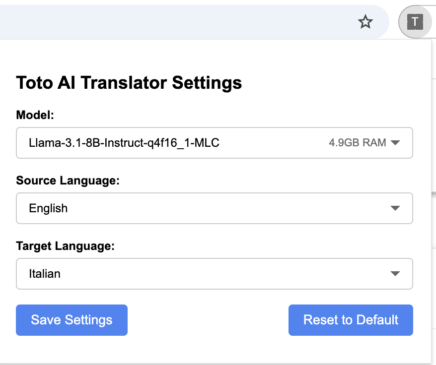

# Toto AI Translator - Browser Extension  

Toto AI Translator runs advanced language models directly in your browser, eliminating the need for external translation services. By leveraging WebGPU acceleration, WebAssembly, and web workers, it delivers efficient local translations while maintaining complete privacy.


## Purpose
The purpose of this extension is to demonstrate the possibility of running machine learning models locally in an efficient way directly in your browser.
By leveraging graphics acceleration, WebAssembly, and web workers, Toto Translator provides translation capabilities without requiring external services or specific server setups like Ollama.


## Key Features

- ✅ **Translation**: Translate text directly on any webpage in any language by using local LLM
- ✅ **Privacy-First**: All processing happens locally on your device
- ✅ **Simple Interface**: Just Alt (or Option)+Click on any text to translate

# User Guide

## Installation
1. Download the [release ZIP file](https://github.com/gtoto007/toto-translator/releases/download/1.0.1/toto-translator-ai-v1.0.1.zip)
2. Unzip the file
3. Load in Chrome/Edge/Brave via chrome://extensions/ (Developer mode)
4. Click "Load unpacked" and select the extracted folder

## How to Use
1.	After installing the extension, navigate to any webpage that contains text.
2.	**Click on the text** you want to translate **while** **holding down the *Alt (or Option for Mac) key*** to activate the translator.
3.	Wait for the LLM download process to complete — this only happens the first time
4.	The translated text will appear below the original content.

Note: The extension uses a local machine learning model that runs directly in your browser, so the first time might take some time to download and load the model.

##  Configuration

Click the extension icon in your browser toolbar to access settings:



### Available Options:

- **Translation Model**: By default, `Llama-3.1-8B-Instruct-q4f16_1-MLC` is selected for its optimal balance between performance and memory usage. You can experiment with other models, though performance may vary.
- **Source Language**: The original language of content you're viewing
- **Target Language**: Your desired translation language

---

# Developer Guide

## Prerequisites

- Node.js
- Yarn package manager

## Loading the Extension
1. Clone this repository:
   ```bash
   git clone https://github.com/gtoto007/toto-translator.git
   cd toto-translator
   ```
2. Build the extension by running:
   ```bash
   yarn install && yarn build:dev
   ```
3. Open Chrome, Edge, or Brave and go to:  
   `chrome://extensions/`
4. Enable **Developer mode** (toggle switch in the top right).
5. Click **Load unpacked** and select the `dist` directory inside the project folder.


## Technology Stack

- [WebLLM](https://github.com/mlc-ai/web-llm) - High-performance in-browser LLM inference engine
- [TypeScript](https://www.typescriptlang.org) - For type-safe code development
- [Chrome Extension API](https://developer.chrome.com/docs/extensions/reference/api) - For browser integration
- [Parcel](https://parceljs.org/) - For efficient bundling and building
